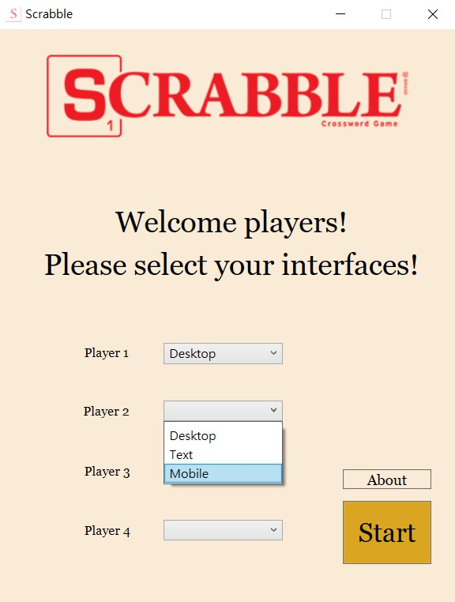
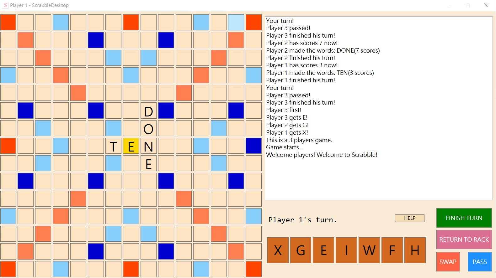
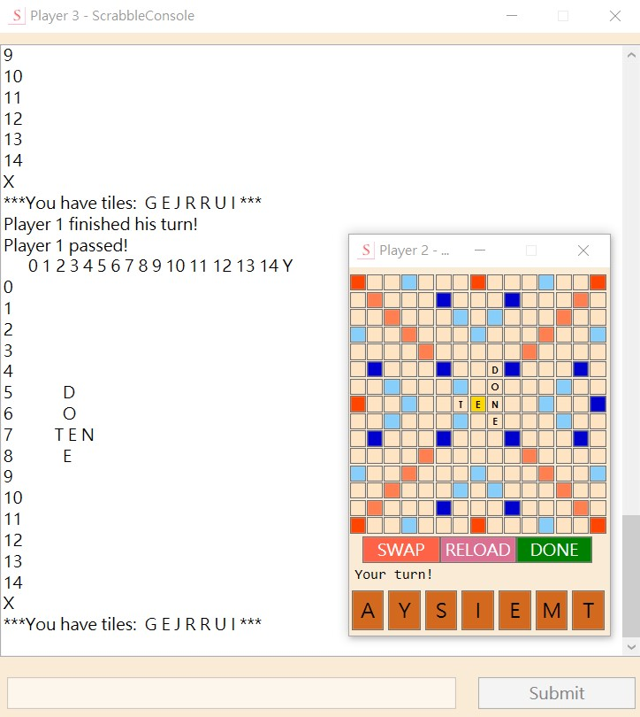

# 
Scrabble

Scrabble game in C#, using <a href="https://en.wikipedia.org/wiki/Windows_Presentation_Foundation">WPF</a>.

## Description
* Standard, but imperfect 100-pieces version of Scrabble
* No "Challenge" option
* No "The Fifty Point Bonus"

## Preview

Click here

  

    
    
    
  

## To build the project
You need Visual Studio ≥2019.

## If you like this, please
* Star
* Fork
* Contribute

## License

MIT

